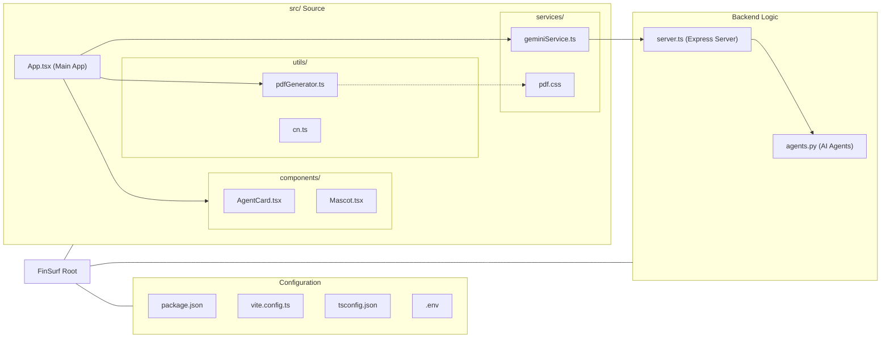
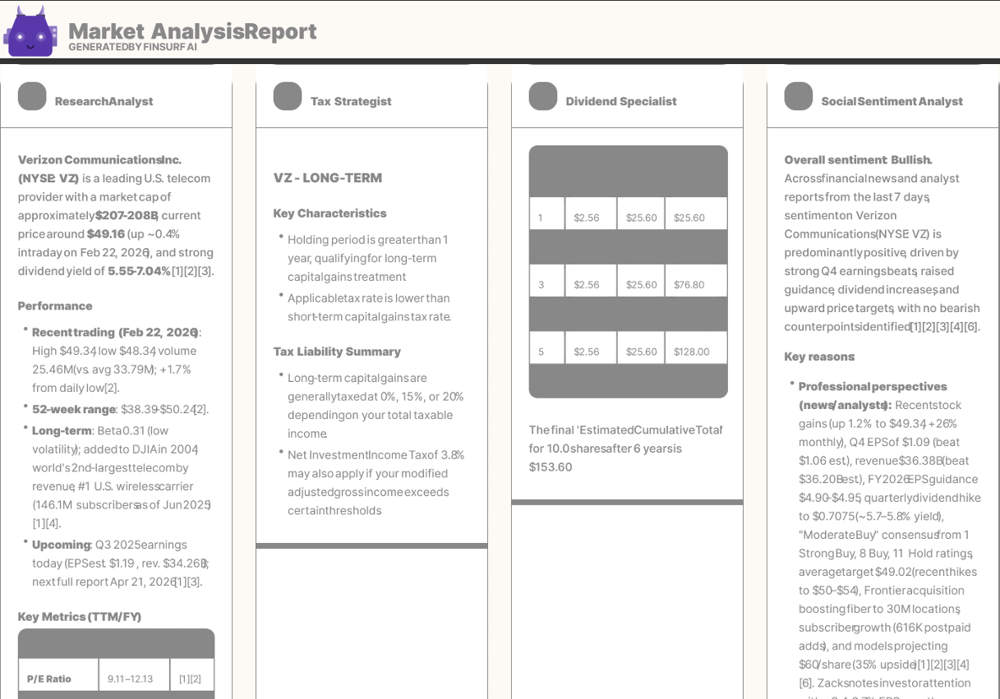
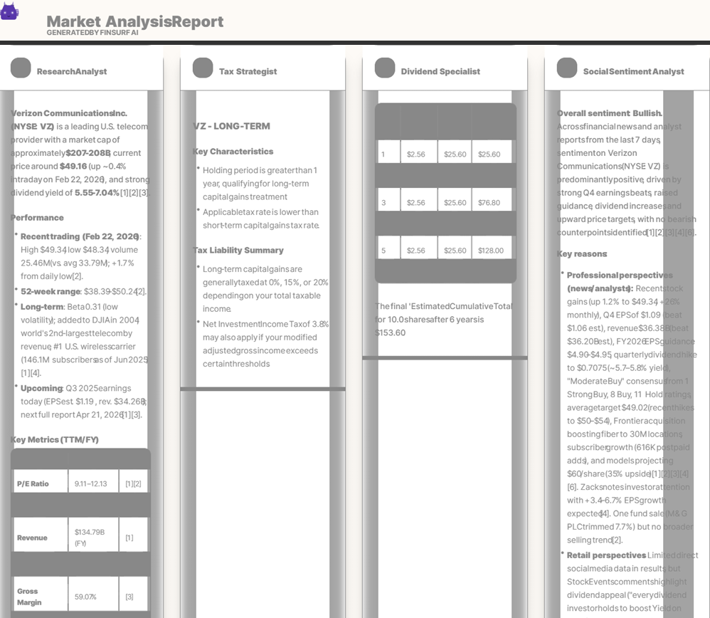

# FinSurf 🏄‍♂️

**FinSurf** is a sophisticated, AI-driven stock analysis platform designed to help investors navigate market volatility. By deploying a collaborative network of specialized autonomous agents, FinSurf transforms raw market data into professional-grade investment reports in seconds.

<p align="center">
  <a href="#-key-features"><b>🚀 Key Features</b></a> &nbsp; • &nbsp;
  <a href="#-the-agent-network"><b>🤖 Agent Network</b></a> &nbsp; • &nbsp;
  <a href="#-tech-stack--architecture"><b>🛠 Tech Stack</b></a> &nbsp; • &nbsp;
  <a href="#-system-architecture--data-flow"><b>🏗 Architecture</b></a> &nbsp; • &nbsp;
  <a href="#-visuals--reports"><b>📸 Visuals & Reports</b></a> &nbsp; • &nbsp;
  <a href="#-getting-started"><b>🚀 Getting Started</b></a> &nbsp; • &nbsp;
  <a href="#-contributing"><b>🤝 Contributing</b></a>
</p>

---

## 🚀 Key Features

*   **🤖 Multi-Agent Intelligence**: Four specialized AI agents work in parallel to provide research, tax, dividend, and sentiment analysis.
*   **📄 Professional PDF Reports**: Generate and download high-quality analysis reports with dynamic page allocation and multi-column layouts.
*   **🎨 Personalized Experience**: Choose between Light/Dark modes and multiple themes, including **Accessible** and **Tropical**.
*   **🔌 Flexible AI Backend**: Robust integration with leading LLM providers (Gemini, OpenAI, Anthropic, Perplexity) with automated fallback mechanisms.
*   **⚡ Modern Tech Stack**: Built with React 19, Vite, Tailwind CSS, Express, and Python for a fast, responsive experience.

---

## 🤖 The Agent Network

FinSurf leverages a modular multi-agent architecture where each agent is a specialist in its domain:

*   **🔍 Research Analyst**: Performs deep-dives into stock performance, key metrics, and fundamental data.
*   **⚖️ Tax Strategist**: Analyzes holding periods and provides US tax implications (Short-term vs. Long-term Capital Gains).
*   **💰 Dividend Specialist**: Projects future payouts with mathematical precision, accounting for fractional shares.
*   **🗣️ Social Sentiment Analyst**: Scours Reddit, X, StockTwits, and news outlets to gauge real-time investor mood.

---

## 🛠 Tech Stack & Architecture

FinSurf is built with a highly modular and encapsulated architecture:

### Frontend (React + Vite + Tailwind CSS)
*   **Modular Components**: Extracted UI elements for better maintainability (e.g., `Mascot`, `AgentCard`).
*   **Advanced Document Engineering**: Professional PDF generation using `html2canvas` and `jsPDF` with row-based grouping and clean page breaks.
*   **Dynamic Theme Engine**: Seamless state management between Light, Dark, Tropical, and Accessibility modes.

### Backend (Express + Python)
*   **Polyglot Execution**: A Node.js/Express server orchestrates specialized Python agents for high-performance AI execution.
*   **LLM Redundancy**: Built-in fallback logic across **Gemini, OpenAI, Anthropic, and Perplexity**.
*   **Real-Time RAG**: Web-connected agents provide up-to-the-minute market data (via Perplexity).

---

## 🏗 System Architecture & Data Flow

### Project Logic Flow
The following diagram illustrates the end-to-end data flow from user input to final analysis and report generation.

```mermaid
graph TD
    subgraph Frontend (React)
        A[User Input: Ticker, Dates, Shares] --> B{Click "Surf"}
        B --> C[App.tsx: runAll]
        C --> D[geminiService.ts: API Helpers]
    end

    subgraph Backend (Express + Python)
        D -->|HTTP POST| E[server.ts: API Endpoints]
        E -->|Child Process| F[agents.py: AI Backend]
    end

    subgraph AI Layer (External APIs)
        F --> G{LLM Orchestrator}
        G -->|Primary| H[Perplexity / Anthropic]
        G -->|Fallback / Logic| I[Gemini / OpenAI]
    end

    I --> J[JSON Results]
    H --> J
    J --> F
    F --> E
    E -->|JSON Response| D
    D --> K[App.tsx: Update State]
    
    subgraph UI & Output
        K --> L[AgentCard.tsx: Render Markdown]
        L --> M{User Actions}
        M -->|Download| N[pdfGenerator.ts]
        N --> O[Professional PDF Report]
    end
```

### Project Structure
This diagram shows the organization of the codebase and key file relationships.



---

## 📸 Visuals & Reports

### Main Dashboard
| Light Mode | Night Mode |
|:---:|:---:|
|  |  |

### Themes
| Standard Theme | Accessibility Theme | Tropical Theme |
|:---:|:---:|:---:|
|  |  |  |

### Results & PDF Output
| Results Dashboard |                     HD PDF Report Sample                      |      Standard PDF Report Sample      |
|:---:|:-------------------------------------------------------------:|:------------------------------------:|
|  |  |  |

---

## 🚀 Getting Started

### Prerequisites
*   **Node.js** (v18+)
*   **Python** (3.9+)

### Installation
1.  **Clone the repository**:
    ```bash
    git clone https://github.com/sachined/FinSurf.git
    cd FinSurf
    ```
2.  **Install dependencies**:
    ```bash
    npm install
    ```
3.  **Configure API Keys**:
    Create a `.env` file in the root directory:
    ```env
    GEMINI_API_KEY=your_key_here
    PERPLEXITY_API_KEY=your_key_here  # Optional
    OPENAI_API_KEY=your_key_here      # Optional
    ANTHROPIC_API_KEY=your_key_here   # Optional
    ```

### Running the App
```bash
npm run dev
```
Open [http://localhost:3000](http://localhost:3000) to start surfing the market.

---

## 🤝 Contributing

We welcome contributions! Whether it's adding new agent modules, strengthening validation layers, or improving the data architecture, your help is appreciated.

1.  **Fork the Repo**: Create your own branch for experiments.
2.  **Report Bugs**: Open an issue if you find any "holes" in the logic or architecture.
3.  **Submit a PR**: Ensure your code follows existing patterns to keep the agent's reasoning pure.

For discussions or questions, reach out to Sachin at `sachin.nediyanchath@gmail.com`.

---

## 📄 License
SPDX-License-Identifier: Apache-2.0
