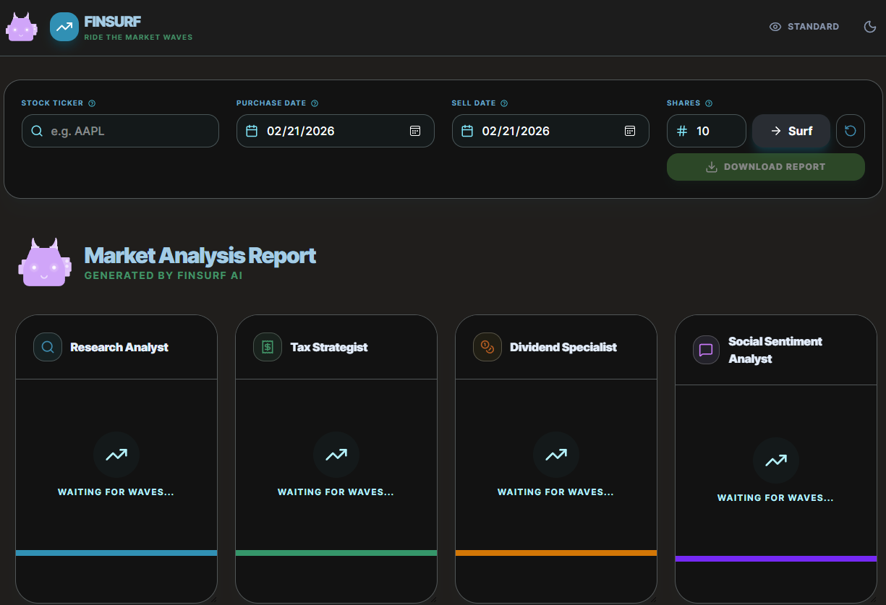
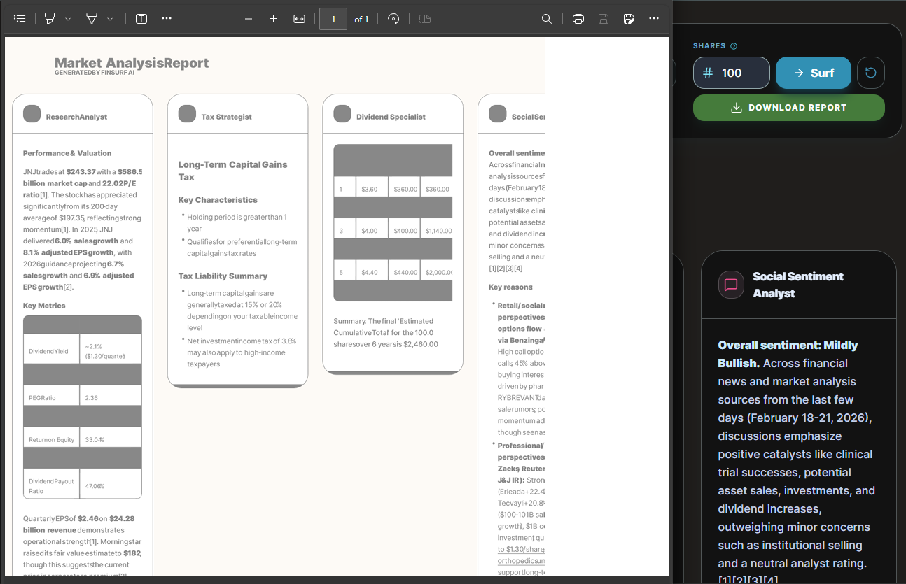

# FinSurf 🏄‍♂️

**FinSurf** is a collaborative network of specialized AI agents designed to help you ride the market waves. It provides comprehensive stock analysis by combining real-time research, tax optimization, dividend forecasting, and social sentiment tracking into one professional report.

---

## 🤖 The Agent Network

FinSurf leverages a multi-agent architecture where each agent is a specialist in its domain:

*   **🔍 Research Analyst**: Performs deep-dives into stock performance, key metrics, and fundamental data.
*   **⚖️ Tax Strategist**: Calculates holding periods and provides concise US tax implications based on transaction dates.
*   **💰 Dividend Specialist**: Projects future payouts with mathematical precision, accounting for fractional shares.
*   **🗣️ Social Sentiment Analyst**: Scours Reddit, X, StockTwits, and major news to gauge investor mood.

---

## 🛠 Architecture & Encapsulation

The project features a highly modular and encapsulated architecture for efficiency and maintainability:

### Frontend (React + Vite + Tailwind CSS)
*   **Modular Components**: UI elements like `Mascot` and `AgentCard` are extracted into `src/components/`.
*   **Centralized Utilities**: Complex logic for PDF generation and styling is encapsulated in `src/utils/`.
*   **Strong Typing**: Shared interfaces and types are centralized in `src/types.ts`.

### Backend (Express + Python)
*   **Encapsulated Execution**: A unified `runPythonAgent` helper manages the lifecycle of Python agent scripts.
*   **Robust Agent Logic**: Python agents utilize dedicated provider clients for Gemini, OpenAI, Anthropic, and Perplexity with built-in fallback mechanisms.

---

## 📸 Visuals & Reports

### Main Dashboard
*Toggle between Light and Dark Mode*

| Light Mode | Night Mode |
|:---:|:---:|
|  |  |

### Themes
*Standard, Accessible, and Tropical*

| Standard Theme | Accessibility Theme | Tropical Theme |
|:---:|:---:|:---:|
|  |  |  |

### Agent Results & Reports
*View results and download professional PDF reports*

| Results Dashboard | PDF Report Sample |
|:---:|:---:|
|  | <br>*(Note: Further work is needed to ensure that the report is comprehensive and not cut-off, as seen in the screenshot)* |

---

## 🚀 Getting Started

### Prerequisites
*   **Node.js** (v18+)
*   **Python** (3.9+)

### Installation
1.  **Clone the repository**:
    ```bash
    git clone https://github.com/sachined/FinSurf.git
    cd FinSurf
    ```
2.  **Install dependencies**:
    ```bash
    npm install
    ```
3.  **Configure API Keys**:
    Create a `.env` file in the root directory:
    ```env
    GEMINI_API_KEY=your_key_here
    PERPLEXITY_API_KEY=your_key_here  # Optional
    OPENAI_API_KEY=your_key_here      # Optional
    ANTHROPIC_API_KEY=your_key_here   # Optional
    ```

### Running the App
```bash
npm run dev
```
Open [http://localhost:3000](http://localhost:3000) to start surfing the market.

---

## 📄 License
SPDX-License-Identifier: Apache-2.0
