# FinSurf 🏄‍♂️

**FinSurf** is a sophisticated, AI-driven stock analysis platform designed to help investors navigate market volatility. By deploying a collaborative network of specialized autonomous agents, FinSurf transforms raw market data into professional-grade investment reports in seconds.

<p align="center">
  <a href="#-overview"><b>🌟 Overview</b></a> &nbsp; • &nbsp;
  <a href="#-key-features"><b>🚀 Key Features</b></a> &nbsp; • &nbsp;
  <a href="#-the-agent-network"><b>🤖 Agent Network</b></a> &nbsp; • &nbsp;
  <a href="#-tech-stack--architecture"><b>🛠 Tech Stack</b></a> &nbsp; • &nbsp;
  <a href="#-system-architecture--data-flow"><b>🏗 Architecture</b></a> &nbsp; • &nbsp;
  <a href="#-visuals--reports"><b>📸 Visuals & Reports</b></a> &nbsp; • &nbsp;
  <a href="#-future-roadmap"><b>🔮 Future Roadmap</b></a> &nbsp; • &nbsp;
  <a href="#-getting-started"><b>🚀 Getting Started</b></a> &nbsp; • &nbsp;
  <a href="#-contributing"><b>🤝 Contributing</b></a>
</p>

---

## 🌟 Overview

**FinSurf** is designed to take the complexity out of stock analysis. Instead of manually searching for data across multiple websites, FinSurf uses a team of **AI Autonomous Agents** to gather, analyze, and summarize everything you need to know about a stock in one place. It’s like having a team of elite financial analysts working for you around the clock.

### 🎯 Who is it for?
*   **Individual Investors**: Get professional-grade research without the complexity.
*   **Time-Savers**: Get a comprehensive view of a stock in seconds, not hours.
*   **Clarity Seekers**: See how research, taxes, dividends, and market sentiment all fit together.

### 📖 How to Use FinSurf
1.  **Identify your Target**: Enter a stock ticker symbol (like `AAPL` for Apple or `TSLA` for Tesla).
2.  **Provide Context**: Enter when you bought (or plan to buy) the stock and how many shares you hold.
3.  **Ride the Wave**: Click the **Surf** button. Our AI agents will immediately begin their specialized analysis.
4.  **Instant Insights**: Review the results in your interactive dashboard as the agents report back.
5.  **Export & Share**: Click **Download PDF** to generate a beautiful, professionally formatted report of the entire analysis.

---

## 🚀 Key Features

*   **🤖 Multi-Agent Intelligence**: Four specialized AI agents work in parallel to provide research, tax, dividend, and sentiment analysis.
*   **📄 Professional PDF Reports**: Optimized, high-quality analysis reports with row-based grouping, automated color conversion for modern CSS, and adaptive pagination. Choose between **Standard** and **High-Density (HD)** layouts via a dedicated toggle.
*   **🎨 Personalized Experience**: Choose between Light/Dark modes and multiple themes, including **Accessibility Optimized** and **Enhanced Tropical** modes.
*   **🏙️ Compact Grid Layout**: Automatic grid compression and seamless card design for a unified report look once generation is complete.
*   **🔌 Flexible AI Backend**: Modular backend with fallback logic across Gemini, OpenAI, Anthropic, and Perplexity.
*   **⚡ Modern Tech Stack**: React 19, Vite 6, Tailwind CSS 4, Express, and a modular Python backend.

---

## 🤖 The Agent Network

FinSurf leverages a modular multi-agent architecture where each agent is a specialist in its domain:

*   **🔍 Research Analyst**: Performs deep-dives into stock performance, key metrics, and fundamental data.
*   **⚖️ Tax Strategist**: Analyzes holding periods and provides US tax implications (Short-term vs. Long-term Capital Gains).
*   **💰 Dividend Specialist**: Projects future payouts with mathematical precision, accounting for fractional shares.
*   **🗣️ Social Sentiment Analyst**: Scours Reddit, X, StockTwits, and news outlets to gauge real-time investor mood.

---

## 🛠 Tech Stack & Architecture

FinSurf is built with a highly modular and encapsulated architecture:

### Frontend (React + Vite + Tailwind CSS)
*   **Modular Components**: Extracted UI elements for better maintainability (e.g., `Mascot`, `AgentCard`, `SearchForm`, `ResultsGrid`).
*   **Advanced Document Engineering**: Professional PDF generation using `html2canvas` and `jsPDF` with parallelized capture, adaptive pagination, automated color conversion (`oklch` support), and **Dual-Density layouts** (Standard vs HD).
*   **Unified Report Look**: Automatic shift to a dense, gapless layout upon analysis completion, providing a cohesive, professional-grade visual experience.
*   **Dynamic Theme Engine**: State-managed experience between Light, Dark, Tropical (immersive blur effects), and Accessibility (Neobrutalist, high-contrast) modes.

### Backend (Express + Python)
*   **Modular Agent Architecture**: Decoupled backend logic where specialized agents (`financial_agents.py`) are orchestrated via a centralized CLI (`agents.py`).
*   **LLM Redundancy**: Built-in fallback logic across **Gemini, OpenAI, Anthropic, and Perplexity**.
*   **Real-Time RAG**: Web-connected agents provide up-to-the-minute market data (via Perplexity).

---

## 🏗 System Architecture & Data Flow

### Project Logic Flow
The following diagram illustrates the end-to-end data flow from user input to final analysis and report generation.

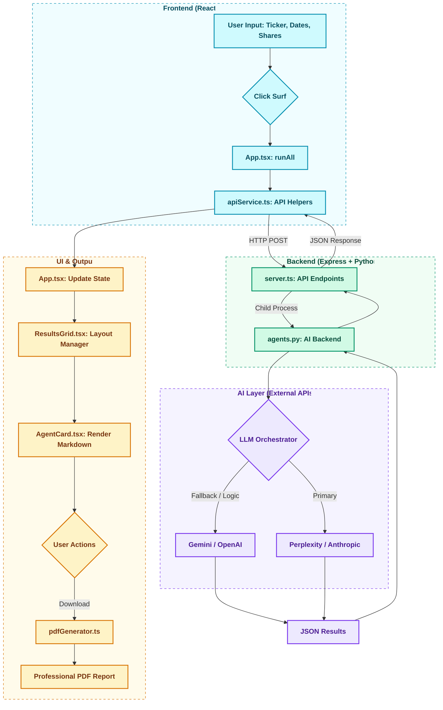

### Project Structure
This diagram shows the organization of the codebase and key file relationships.

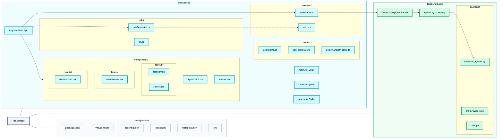

---

## 📸 Visuals & Reports

### Main Dashboard
| Light Mode | Night Mode |
|:---:|:---:|
| 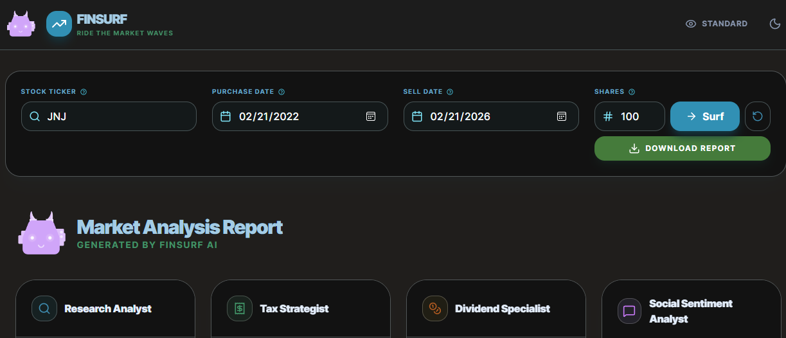 | 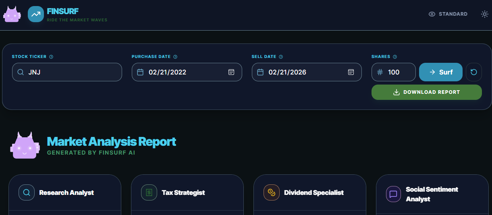 |

### Themes
| Standard Theme | Accessibility Theme | Tropical Theme |
|:---:|:---:|:---:|
|  | 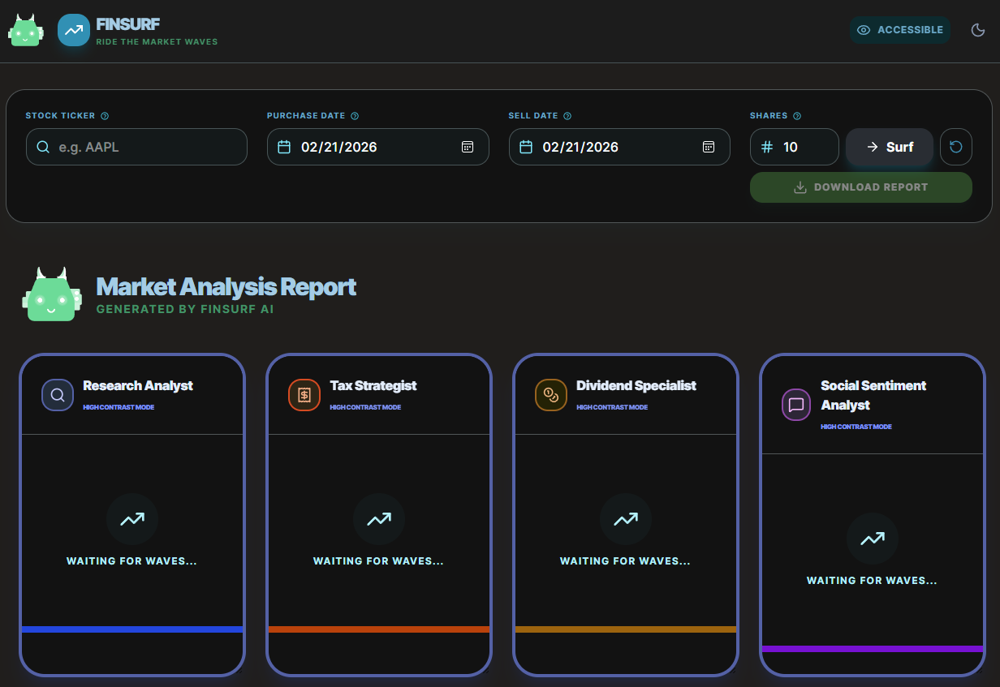 | 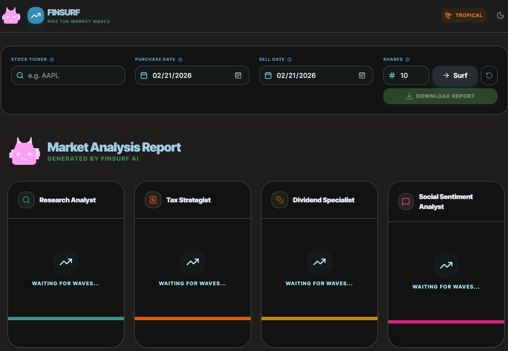 |

### Results & PDF Output
|                             Results Dashboard                             | Market Analysis PDF Report |
|:-------------------------------------------------------------------------:|:---:|
| 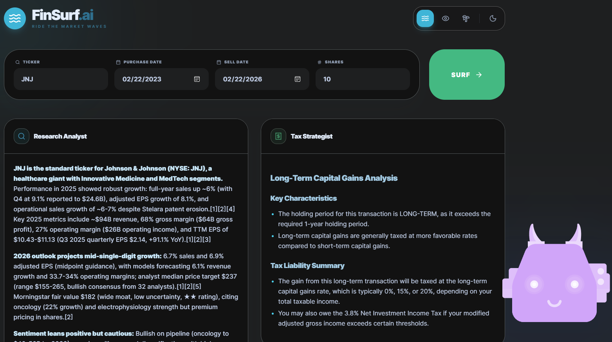<br/>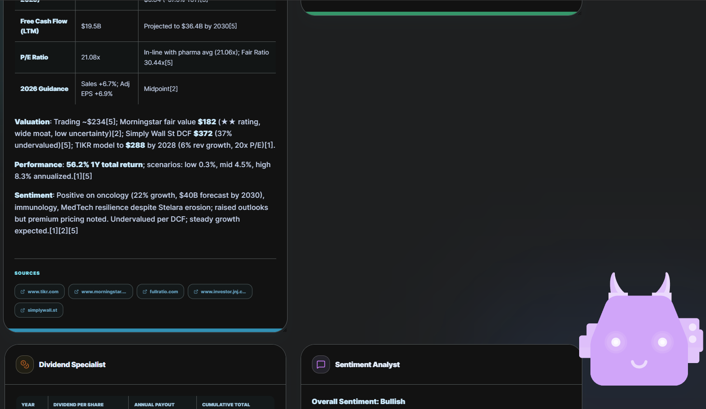 | 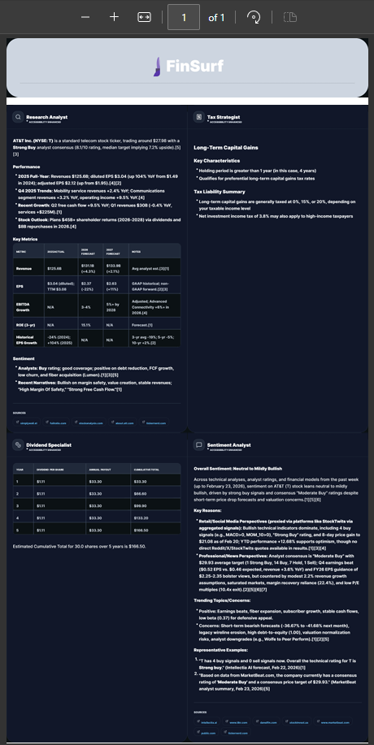 |

### Optimized Report Layout
| PDF Mode Comparison (HD vs Standard) | Adaptive PDF Pagination |
|:---:|:---:|
| 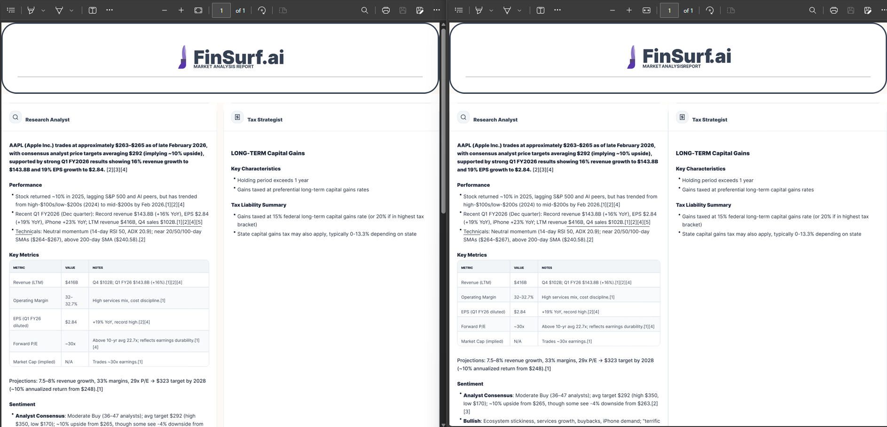 | 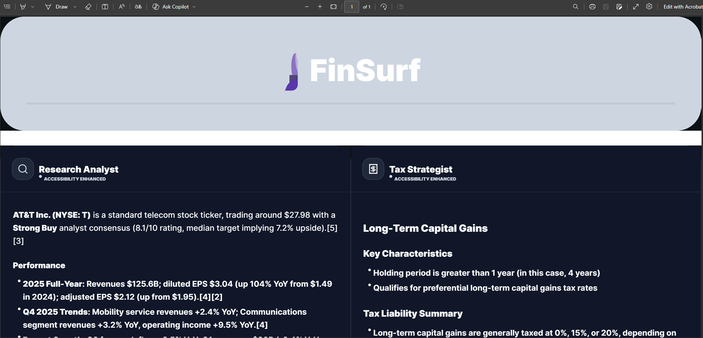 |

---

## 🔮 Future Roadmap

FinSurf is an evolving ecosystem. To maintain a simple and efficient development cycle as a solo project, we are focusing on high-impact, achievable milestones that prioritize core functionality and user experience:

### 📈 Phase 1: The Profit Navigator (Q2 2026)
*   **Feature**: Historical Profit Analyzer & Exit Strategist.
*   **Why**: Bridges the gap between research and reality by automatically retrieving price history for your purchase/sell dates. It intelligently handles "Future Sell Dates" as a unique edge case, providing projected insights for planned exits based on current market trends.
*   **Difficulty**: 💪💪 Medium
*   **Timeline**: April - June 2026

### 🌊 Phase 2: Portfolio Wave (Q3 - Q4 2026)
*   **Feature**: Multi-Ticker Batch Analysis (CSV Upload).
*   **Why**: Allows investors to analyze their entire holding list in a single session rather than ticker-by-ticker, making it more practical for those with 10+ stocks.
*   **Difficulty**: 💪💪 Medium
*   **Timeline**: July - December 2026

### 🏛️ Phase 3: Archive Vault (2027)
*   **Feature**: Analysis History Database & Interactive AI Chat.
*   **Why**: Lets users save their reports to track changes over time and ask follow-up questions to the agents through a persistent chat interface.
*   **Difficulty**: 💪💪💪 High
*   **Timeline**: 2027 and Beyond

### 🎯 Stretch Goal: Options Radar
*   **Feature**: Popular Options Summary.
*   **Why**: Provides a quick overview of the most active options contracts for the selected stock, including type (Call/Put), strike price, expiration, and real-time bid/ask prices. This helps users gauge market sentiment and volatility at a glance.
*   **Difficulty**: 💪💪 Medium
*   **Timeline**: Stretch Goal

---

## 🚀 Getting Started

### Prerequisites
*   **Node.js** (v18+)
*   **Python** (3.9+)

### Installation
1.  **Clone the repository**:
    ```bash
    git clone https://github.com/sachined/FinSurf.git
    cd FinSurf
    ```
2.  **Install dependencies**:
    ```bash
    npm install
    ```
3.  **Configure API Keys**:
    Create a `.env` file in the root directory:
    ```env
    GEMINI_API_KEY=your_key_here
    PERPLEXITY_API_KEY=your_key_here  # Optional
    OPENAI_API_KEY=your_key_here      # Optional
    ANTHROPIC_API_KEY=your_key_here   # Optional
    ```

### Running the App
```bash
npm run dev
```
Open [http://localhost:3000](http://localhost:3000) to start surfing the market.

---

## 🤝 Contributing

We welcome contributions! Whether it's adding new agent modules, strengthening validation layers, or improving the data architecture, your help is appreciated.

1.  **Fork the Repo**: Create your own branch for experiments.
2.  **Report Bugs**: Open an issue if you find any "holes" in the logic or architecture.
3.  **Submit a PR**: Ensure your code follows existing patterns to keep the agent's reasoning pure.

For discussions or questions, reach out to Sachin at `sachin.nediyanchath@gmail.com`.

---

## 📄 License
SPDX-License-Identifier: Apache-2.0
