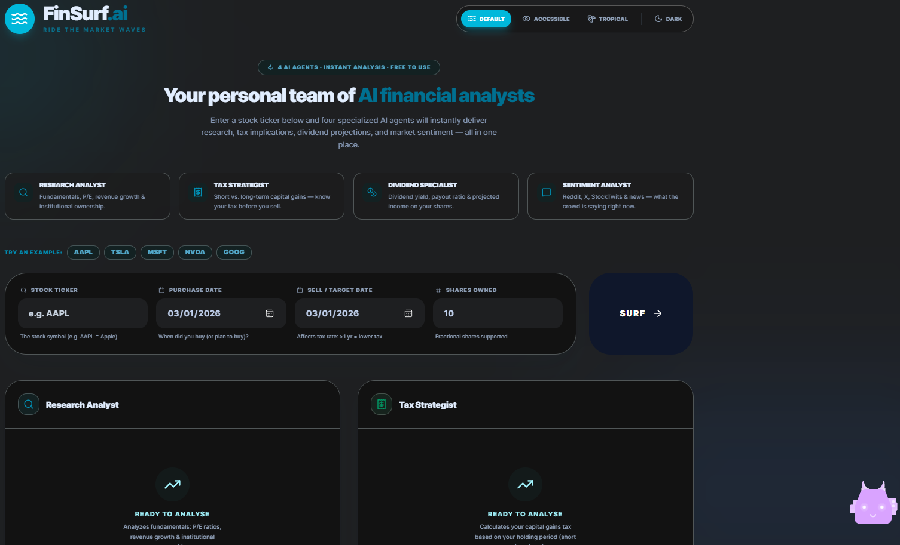
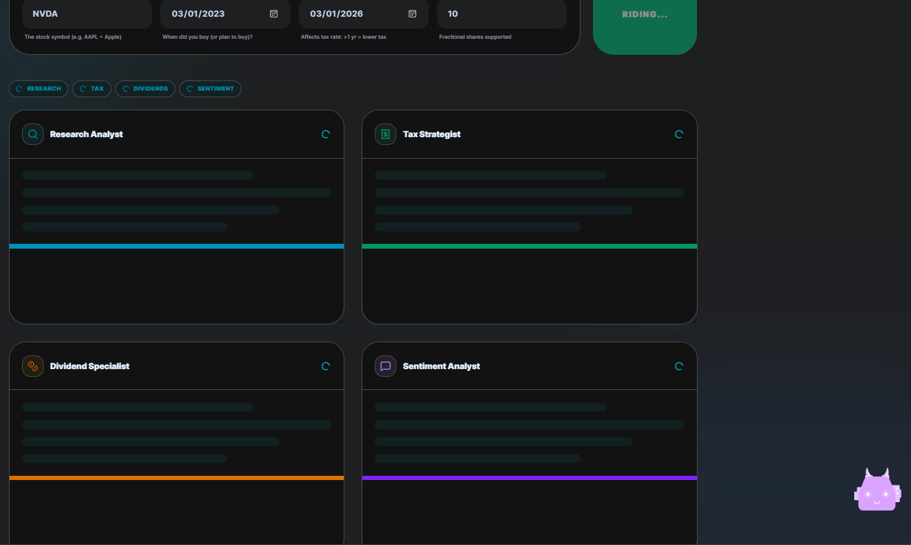
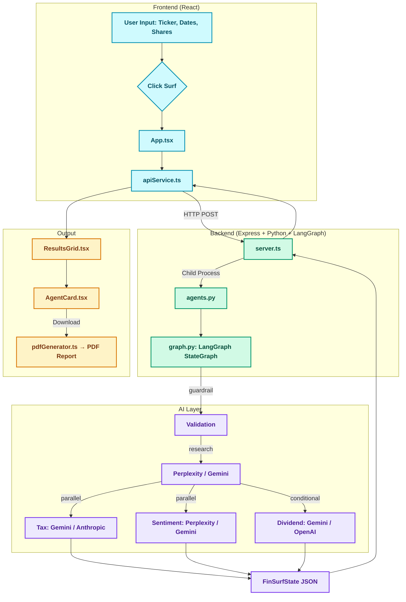
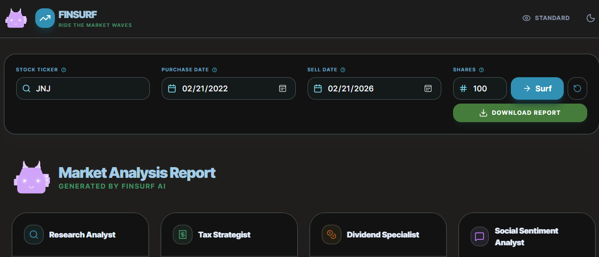
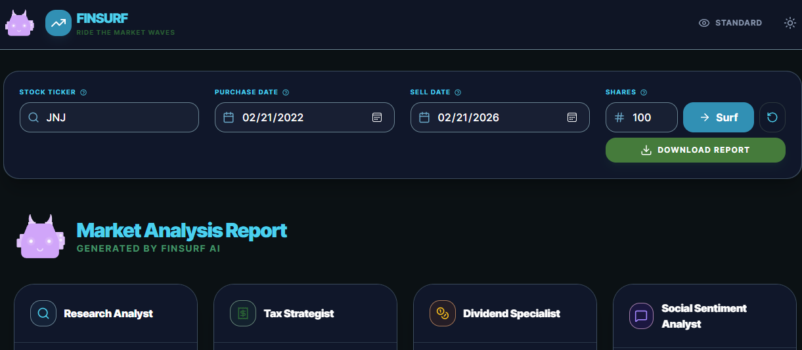
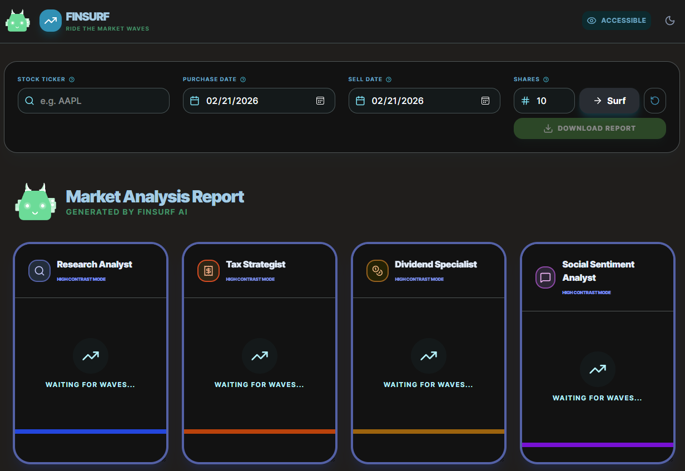
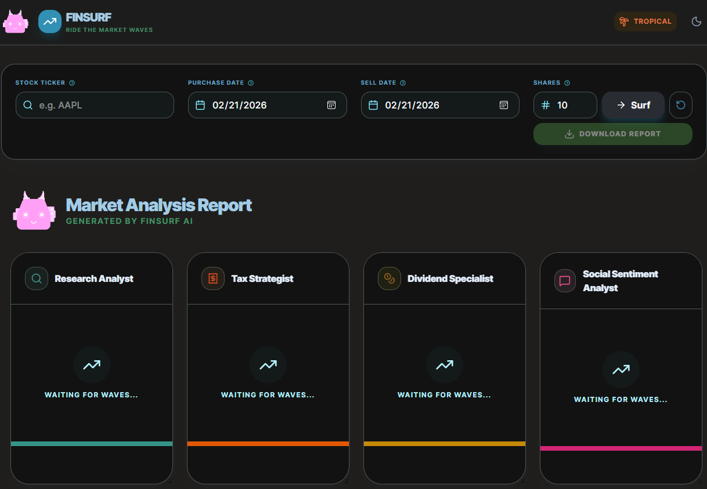
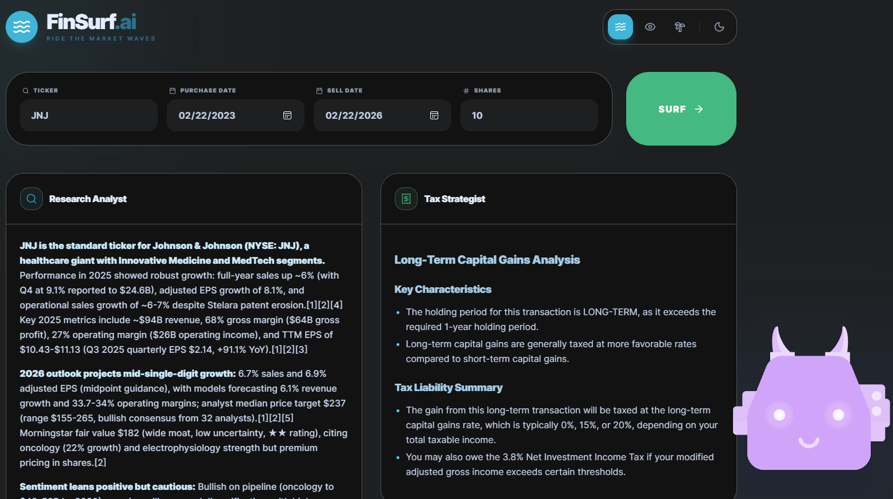
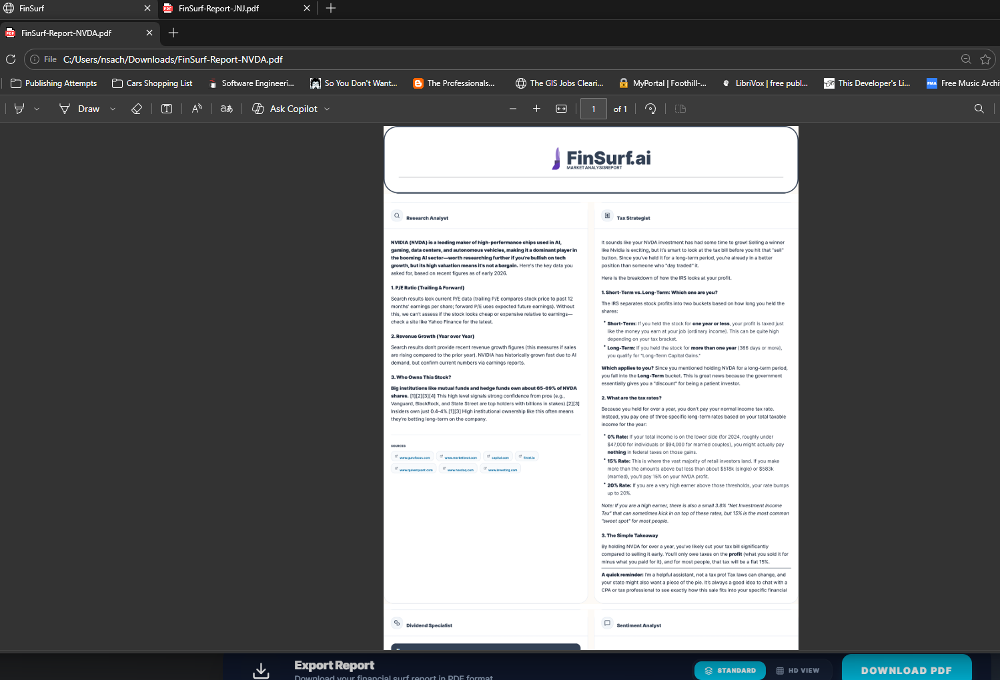

# FinSurf 🏄‍♂️ https://finsurf.net/


*AI-Powered Stock Analysis Platform*

**FinSurf** is an AI-driven stock analysis platform that deploys a collaborative network of specialized autonomous agents to transform raw market data into professional-grade investment reports in seconds — covering fundamentals, tax implications, dividends, and market sentiment.

---

## Project Status

> Core analysis pipeline is fully functional end-to-end. Active development continues.

| Feature | Status |
|---|---|
| Guardrail Agent | ✅ Production |
| Research Agent | ✅ Production |
| Tax Strategist Agent | ✅ Production |
| Dividend Specialist Agent | ✅ Production |
| Sentiment Agent | ✅ Production |
| PDF Export (Standard + HD) | ✅ Production |
| React + Vite Frontend | ✅ Production |
| Tax Clock | 🔨 In Development |
| Blind Spot Detector | 🔨 In Development |
| Sector Health Monitor | 📋 Planned |

---

## 🌟 What It Does

Enter a stock ticker, your purchase date, and share count. FinSurf's agent network immediately gets to work:

1. **Guardrail Agent** validates your query before spending any API tokens
2. **Research Agent** pulls fundamentals, key metrics, and recent performance
3. **Tax Strategist** calculates your holding period and capital gains tax status
4. **Sentiment Analyst** aggregates signals from Reddit, X, StockTwits, and news outlets
5. **Dividend Specialist** *(conditional)* projects future payouts using Python arithmetic — not LLM guesses

Results appear in an interactive dashboard. Click **Download PDF** for a professionally formatted report in Standard or HD layout.

> ⚠️ **Disclaimer:** FinSurf is an informational research tool, not financial advice. Verify all outputs independently before making any investment decision.

| Landing Page | Agents Running |
|:---:|:---:|
|  |  |

---

## ⚙️ How It Works

FinSurf uses a **LangGraph state machine** where each agent is a specialist node in a directed graph. Tax and Sentiment run in parallel after Research completes. The Dividend node fires only when Research signals the ticker pays dividends — saving tokens on every non-dividend query.

```
User Input → 🛡️ Guardrail → 🔍 Research → ⚖️ Tax ‖ 🗣️ Sentiment → 💰 Dividend (conditional) → Report
```


```mermaid
graph TD
    classDef fe fill:#cffafe,stroke:#0891b2,stroke-width:2px,color:#044e5f,font-weight:bold;
    classDef be fill:#d1fae5,stroke:#059669,stroke-width:2px,color:#064e3b,font-weight:bold;
    classDef ai fill:#ede9fe,stroke:#7c3aed,stroke-width:2px,color:#4c1d95,font-weight:bold;
    classDef ui fill:#fef3c7,stroke:#d97706,stroke-width:2px,color:#78350f,font-weight:bold;

    subgraph FE["Frontend (React)"]
        A[User Input: Ticker, Dates, Shares] --> B{Click Surf}
        B --> C[App.tsx]
        C --> D[apiService.ts]
    end

    subgraph BE["Backend (Express + Python + LangGraph)"]
        D -->|HTTP POST| E[server.ts]
        E -->|Child Process| F[agents.py]
        F --> G[graph.py: LangGraph StateGraph]
    end

    subgraph AL["AI Layer"]
        G -->|guardrail| GA[Validation]
        GA -->|research| GB[Perplexity / Gemini]
        GB -->|parallel| GC[Tax: Gemini / Anthropic]
        GB -->|parallel| GD[Sentiment: Perplexity / Gemini]
        GB -->|conditional| GE[Dividend: Gemini / OpenAI]
    end

    GC --> J[FinSurfState JSON]
    GD --> J
    GE --> J
    J --> E
    E --> D

    subgraph UI["Output"]
        D --> K[ResultsGrid.tsx]
        K --> L[AgentCard.tsx]
        L -->|Download| M[pdfGenerator.ts #rarr; PDF Report]
    end

    class A,B,C,D fe;
    class E,F,G be;
    class GA,GB,GC,GD,GE,J ai;
    class K,L,M ui;
```

---

## 🛠 Tech Stack

| Layer | Technologies |
|---|---|
| **Frontend** | React 19, Vite 6, TypeScript, Tailwind CSS 4 |
| **Backend** | Node.js, Express, Python 3 |
| **AI Orchestration** | LangGraph, LangChain |
| **LLM Providers** | Gemini, Perplexity, OpenAI, Anthropic (with fallback logic) |
| **PDF Generation** | html2canvas, jsPDF (custom `oklch` color resolver for Tailwind CSS 4) |
| **Telemetry** | SQLite — per-agent token usage, cost tracking, configurable daily budget cap |
| **Testing** | Python `unittest` with fully mocked LLM calls |
| **Deployment** | Docker, Caddy (automatic HTTPS via Let's Encrypt) |

---

## 💡 What I Learned Building This

### 1. Validate with Python, explain with LLMs
Early versions asked the LLM to calculate dividend projections including fractional shares. Outputs looked plausible but were frequently wrong in ways that compound over time. **Fix:** Python handles all arithmetic; the LLM handles explanation only. This pattern applies to any financial agent where precision matters.

### 2. LangGraph over CrewAI for conditional workflows
For workflows where one agent's output determines whether another agent runs at all, LangGraph's explicit state management is worth the steeper learning curve. CrewAI is faster to start; LangGraph gives you the fine-grained routing control you need when the logic gets complex.

### 3. PDF generation from Tailwind CSS 4 is non-trivial
`html2canvas` predates CSS custom properties and the `oklch` color space. If you are generating PDFs from a Tailwind CSS 4 app, build the color-resolution utility early and test across browsers before it becomes a blocker.

---

## 📸 Visuals

| Light Mode | Night Mode |
|:---:|:---:|
|  |  |

| Accessibility Theme | Tropical Theme |
|:---:|:---:|
|  |  |

| Results Dashboard | PDF Report |
|:---:|:---:|
|  |  |

---

## 🚀 Getting Started

### Prerequisites
- **Node.js** v18+
- **Python** 3.9+

### Installation

```bash
git clone https://github.com/sachined/FinSurf.git
cd FinSurf
npm install
```

Create a `.env` file with your API keys:

```env
GEMINI_API_KEY=your_key_here
PERPLEXITY_API_KEY=your_key_here  # Optional but recommended
OPENAI_API_KEY=your_key_here      # Optional
ANTHROPIC_API_KEY=your_key_here   # Optional
PORT=3000
```

### Run

```bash
npm run dev
```

Open [http://localhost:3000](http://localhost:3000).

### Docker

```bash
cp .env.example .env   # fill in your keys
docker compose build
docker compose up -d
# → http://localhost:3000
```

For internet-facing deployment with automatic HTTPS, see the [Docker section of CONTRIBUTING.md](CONTRIBUTING.md#-docker--production-deployment).

---

## 🔮 Roadmap

| Phase | Feature | Notes | Timeline |
|---|---|---|---|
| **Phase 1** | Historical Profit Analyzer | P&L, holding period, and cost-basis arithmetic in Python — no LLM guesses | Q2 2026 |
| **Phase 2** | Multi-Ticker Batch Analysis (CSV upload) | Sequential processing with SSE progress stream; max 20 tickers per batch; per-request token budget enforced before processing starts | Q3–Q4 2026 |
| **Phase 3a** | Analysis History Database | Persist `FinSurfState JSON` to SQLite; simple history list UI and re-open-report feature — no LLM involved | Early 2027 |
| **Phase 3b** | AI Chat | Single-session "ask about this analysis" chat built on top of 3a using a conversational LangGraph node; cross-analysis RAG deferred | Mid–Late 2027 |
| **Stretch** | Scenario Planner | "If price reaches $X, your gain is Y and your tax status is Z" — informational only, not prescriptive | TBD |
| **Stretch** | Options Radar | Read-only display of top 5 contracts by open interest; no strategy recommendations; data source (Tradier / Alpaca free tier) must be confirmed before work begins | TBD |

---

## 🤝 Contributing

Contributions are welcome — new agent modules, improved validation, bug reports, or tests. See [CONTRIBUTING.md](CONTRIBUTING.md) for setup instructions, code conventions, and the PR process.

---

## 📄 License
SPDX-License-Identifier: Apache-2.0
