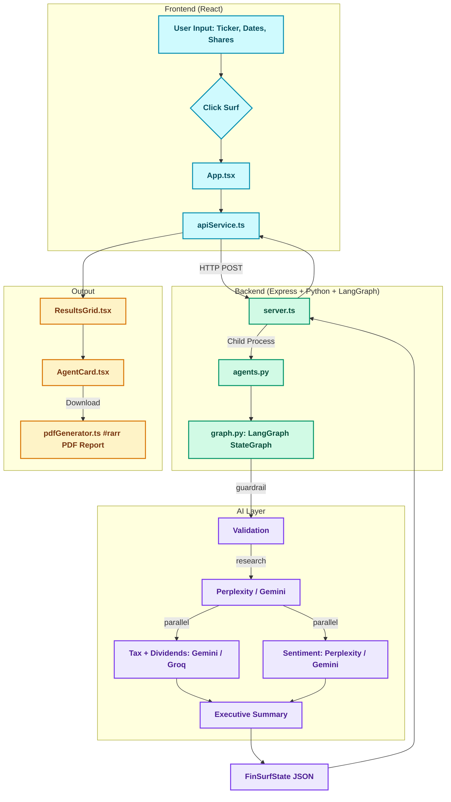

# FinSurf 🏄‍♂️ https://finsurf.net/

> **Last Updated:** March 19, 2026


*AI-Powered Stock Analysis Platform*

**FinSurf** is an AI-driven stock analysis platform that deploys a collaborative network of specialized autonomous agents to transform raw market data into professional-grade investment reports in seconds — covering fundamentals, tax implications, dividends, and market sentiment.

---

## Project Status

> Core analysis pipeline is fully functional end-to-end. Active development continues.

| Feature                    | Status            |
|----------------------------|-------------------|
| Guardrail Agent            | ✅ Production      |
| Research Agent             | ✅ Production      |
| Tax Strategist Agent       | ✅ Production      |
| Dividend Specialist Agent  | ✅ Production      |
| Sentiment Agent            | ✅ Production      |
| PDF Export (Standard + HD) | ✅ Production      |
| React + Vite Frontend      | ✅ Production      |
| Timestamp Badges           | ✅ Production      |
| Recent Searches            | ✅ Production      |
| Tax Clock                  | 📋 Planned        |
| Blind Spot Detector        | 📋 Planned        |
| Sector Health Monitor      | 📋 Planned        |

---

## 🌟 What It Does

Enter a stock ticker, your purchase date, and share count. FinSurf's agent network immediately gets to work:

1. **Guardrail Agent** validates your query before spending any API tokens
2. **Research Agent** pulls fundamentals, key metrics, and recent performance
3. **Tax Strategist** calculates your holding period and capital gains tax status
4. **Sentiment Analyst** aggregates signals from StockTwits, Finnhub news, Alpha Vantage sentiment, and SEC EDGAR filings
5. **Dividend Specialist** *(conditional)* projects future payouts using Python arithmetic — not LLM guesses

Results appear in an interactive dashboard with real-time timestamp badges showing data freshness — "Just now" for recent data, or relative time like "2 minutes ago". Stale data (older than 1 hour) displays an amber warning badge. Your last 5 searches are saved locally for quick re-access. Click **Download PDF** for a professionally formatted report in Standard or HD layout.

> ⚠️ **Disclaimer:** FinSurf is an informational research tool, not financial advice. Verify all outputs independently before making any investment decision.

|                  Landing Page                  |                  Agents Running                  |
|:----------------------------------------------:|:------------------------------------------------:|
|  |  |

---

## ⚙️ How It Works

FinSurf uses a **LangGraph state machine** where each agent is a specialist node in a directed graph. Tax+Dividend and Sentiment run in parallel after Research completes. The dividend narration is template-based (zero LLM tokens) and skipped automatically for non-dividend stocks — saving tokens on every non-dividend query.

```
User Input → 🛡️ Guardrail → 🔍 Research → [⚖️ Tax + 💰 Dividends] ‖ 🗣️ Sentiment → 📋 Executive Summary → Report
```



---

## 🛠 Tech Stack

| Layer                | Technologies                                                                 |
|----------------------|------------------------------------------------------------------------------|
| **Frontend**         | React 19, Vite 6, TypeScript, Tailwind CSS 4                                 |
| **Backend**          | Node.js, Express, Python 3                                                   |
| **AI Orchestration** | LangGraph, LangChain                                                         |
| **LLM Providers**    | Gemini, Perplexity, Groq, Ollama (with fallback logic)                       |
| **PDF Generation**   | html2canvas, jsPDF (custom `oklch` color resolver for Tailwind CSS 4)        |
| **Telemetry**        | SQLite — per-agent token usage, cost tracking, configurable daily budget cap |
| **Testing**          | Python `unittest` with fully mocked LLM calls                                |
| **Deployment**       | Docker, Caddy (automatic HTTPS via Let's Encrypt)                            |
| **Local Storage**    | Recent searches (last 5 tickers), theme preferences, VIP pass tokens         |

---

## 💡 What I Learned Building This

### 1. Validate with Python, explain with LLMs
Early versions asked the LLM to calculate dividend projections including fractional shares. Outputs looked plausible but were frequently wrong in ways that compound over time. **Fix:** Python handles all arithmetic; the LLM handles explanation only. This pattern applies to any financial agent where precision matters.

### 2. LangGraph over CrewAI for conditional workflows
For workflows where one agent's output determines whether another agent runs at all, LangGraph's explicit state management is worth the steeper learning curve. CrewAI is faster to start; LangGraph gives you the fine-grained routing control you need when the logic gets complex.

### 3. PDF generation from Tailwind CSS 4 is non-trivial
`html2canvas` predates CSS custom properties and the `oklch` color space. If you are generating PDFs from a Tailwind CSS 4 app, build the color-resolution utility early and test across browsers before it becomes a blocker. Additionally, card headers now use `text-slate-950` in both light and dark modes to ensure text remains visible in PDFs regardless of theme.

### 4. Real-time data freshness matters to users
Adding timestamp badges ("Just now", "2 minutes ago") to each agent card significantly improves trust. Users want to know when their data was fetched. Stale data warnings (amber badge for data older than 1 hour) prevent decisions based on outdated information. The backend sends timestamps with every response; the frontend displays them via a dedicated `TimestampBadge` component that auto-updates every minute.

### 5. Recent searches drive repeat engagement
localStorage-based recent searches (last 5 tickers) provide quick re-access without adding backend complexity or API costs. Users can re-run analyses on familiar tickers with one click. This pattern is especially valuable for watchlist-style usage before a formal watchlist feature exists.

---

## 📸 Visuals

|                 Light Mode                 |                 Night Mode                  |
|:------------------------------------------:|:-------------------------------------------:|
|  |  |

|                Accessibility Theme                 |                  Tropical Theme                  |
|:--------------------------------------------------:|:------------------------------------------------:|
|  |  |

|             Results Dashboard              |                      PDF Report                       |
|:------------------------------------------:|:-----------------------------------------------------:|
|  |  |

---

## 🚀 Getting Started

### Prerequisites
- **Node.js** v24+
- **Python** 3.13+

### Installation

```bash
git clone https://github.com/sachined/FinSurf.git
cd FinSurf
npm install
```

Create a `.env` file with your API keys:

```env
GEMINI_API_KEY=your_key_here
PERPLEXITY_API_KEY=your_key_here  # Optional but recommended
GROQ_API_KEY=your_key_here       # Optional
PORT=3000
```

### Run

```bash
npm run dev
```

Open [http://localhost:3000](http://localhost:3000).

### Docker

```bash
cp .env.example .env   # fill in your keys
docker compose build
docker compose up -d
# → http://localhost:3000
```

For internet-facing deployment with automatic HTTPS, see the [Docker section of DEVELOPMENT_GUIDE.md](DEVELOPMENT_GUIDE.md#-docker--production-deployment).

---

## 🔮 Roadmap

| Phase        | Feature                                  | Notes                                                                                                                                                                          | Timeline      |
|--------------|------------------------------------------|--------------------------------------------------------------------------------------------------------------------------------------------------------------------------------|---------------|
| ✅ **Done**  | Historical Profit Analyzer               | P&L, holding period, and cost-basis arithmetic in Python — no LLM guesses. Integrated into every analysis run via `pnl_summary`.                                               | Complete      |
| **Phase 2**  | Watchlist                                | Save tickers for quick one-click re-analysis. Zero cost until the user triggers a run — drives repeat engagement without background LLM calls.                                  | Q2–Q3 2026    |
| **Phase 3**  | Portfolio P&L Dashboard                  | User enters positions (ticker, shares, cost basis, purchase date); system calculates total P&L, unrealized gains, and short/long-term tax exposure using Python + yfinance only — no LLM calls per stock. | Q3–Q4 2026    |
| **Phase 4**  | Tax Year Summary                         | Given a set of positions, output realized gains split by short-term and long-term in a clean summary — pure Python arithmetic, no LLM. Especially useful around tax season.    | Q4 2026       |
| **Phase 5**  | Analysis History Database                | Persist `FinSurfState JSON` to SQLite; simple history list UI and re-open-report feature — no LLM involved                                                                     | Early 2027    |
| **Phase 6**  | Scenario Planner                         | "If price reaches $X, your gain is $Y and your tax status is Z" — pure Python math, informational only, not prescriptive                                                       | Mid 2027      |
| **Phase 7**  | AI Chat                                  | Single-session "ask about this analysis" chat built on top of Phase 5 history using a conversational LangGraph node; cross-analysis RAG deferred                               | Late 2027     |
| **Stretch**  | Options Radar                            | Read-only display of top contracts by open interest; no strategy recommendations; data source (Tradier / Alpaca free tier) must be confirmed before work begins                | TBD           |
| **India**    | India Market Mode (`.NS` / `.BO`)        | Auto-detect NSE/BSE tickers and switch to Indian tax rules, INR display, and India-specific data sources — no user configuration required                                      | TBD           |
| **India**    | Indian Tax Module                        | STCG (20%), LTCG (12.5% above ₹1.25L), STT, April–March fiscal year; reflects post-July 2024 Union Budget rates; DTAA flag for NRI investors                                 | TBD           |
| **India**    | NRI Dual-Currency View                   | Show INR value alongside USD equivalent for each position; surface FX impact separately from stock performance so NRIs see their true USD return                               | TBD           |
| **India**    | BSE Corporate Announcements              | Equivalent of SEC EDGAR 8-K for Indian-listed companies; material events sourced from BSE disclosure feed                                                                      | TBD           |
| **Japan**    | Japan Market Mode (`.T` tickers)         | Auto-detect TSE tickers and switch to Japanese market context; initial release English-only targeting foreign residents in Japan and international TSE investors                | TBD           |
| **Japan**    | Japanese Tax Module                      | Flat 20.315% capital gains (income tax + reconstruction tax + local inhabitant tax); NISA account awareness (¥18M lifetime tax-free); no holding-period distinction            | TBD           |
| **Japan**    | J-Quants Data Integration                | JPX's official API for TSE price history, corporate financials, and earnings data; supplements yfinance which thins out on mid/small-cap Japanese names                        | TBD           |
| **Japan**    | EDINET Filings                           | Japan's official securities filing database (FSA/Ministry of Finance); equivalent of SEC EDGAR for TSE-listed companies; no API key required                                   | TBD           |
| **Japan**    | Japanese-Language Product                | Full Japanese UI/UX adaptation including shareholder perks (株主優待) database, density-first layout norms, and Japanese-native copy — separate product decision               | TBD           |

---

## 🤝 Contributing

Contributions are welcome — new agent modules, improved validation, bug reports, or tests. See [DEVELOPMENT_GUIDE.md](DEVELOPMENT_GUIDE.md) for setup instructions, code conventions, and the PR process.

---

## 🌍 Global Community

FinSurf's long-term mission is to bring professional-grade financial analysis to retail investors
everywhere — not just the US. If you invest in markets outside the US and would like to see
FinSurf support your local exchange, tax rules, and data sources, reach out or open a discussion
on GitHub. Every market expansion starts with someone who knows it from the inside.

👉 [Open a GitHub Discussion](https://github.com/sachined/FinSurf/discussions) or
[file an issue](https://github.com/sachined/FinSurf/issues) — label it `global-expansion`.

---

## 📄 License
SPDX-License-Identifier: Apache-2.0